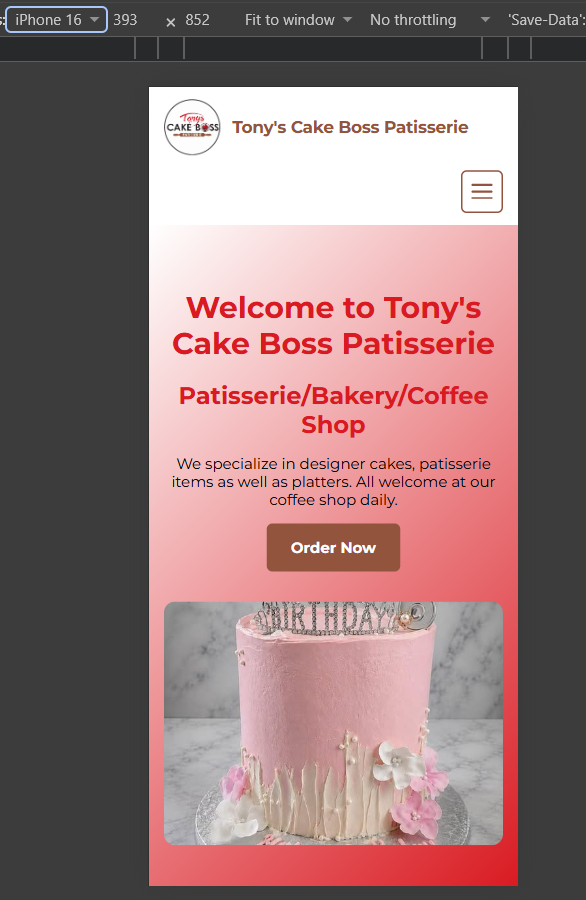
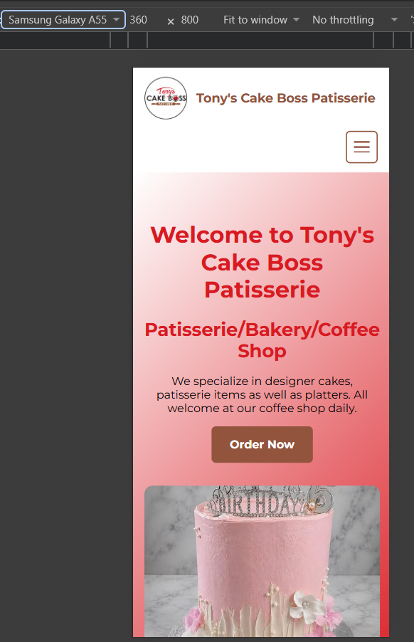
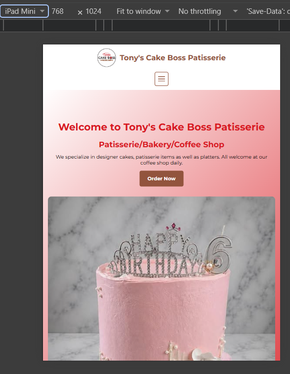
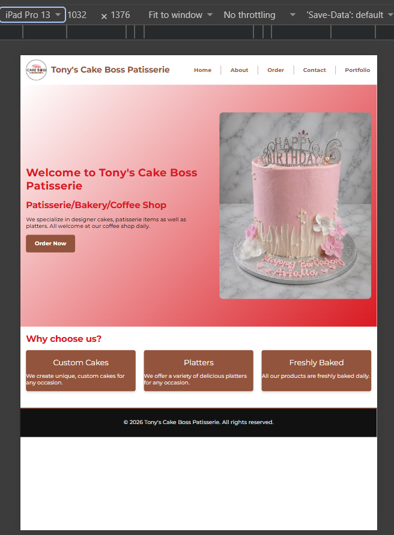
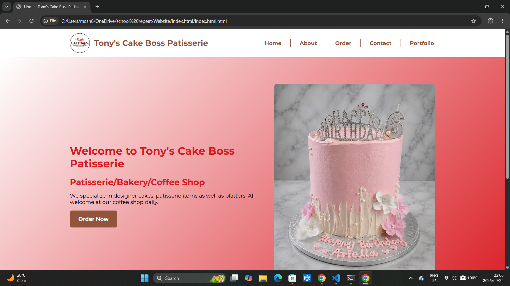
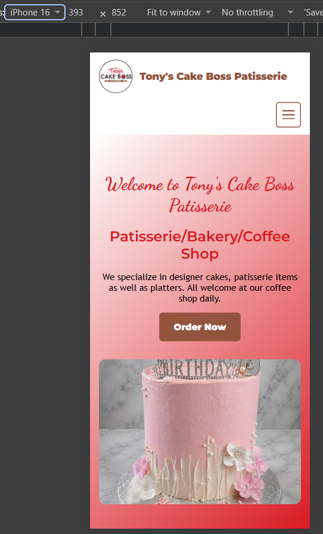
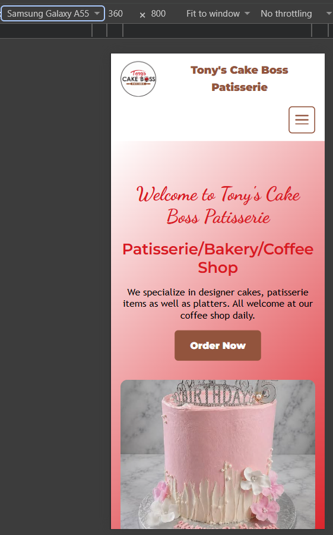
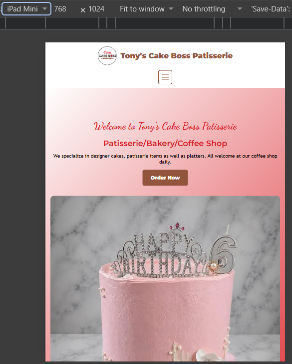
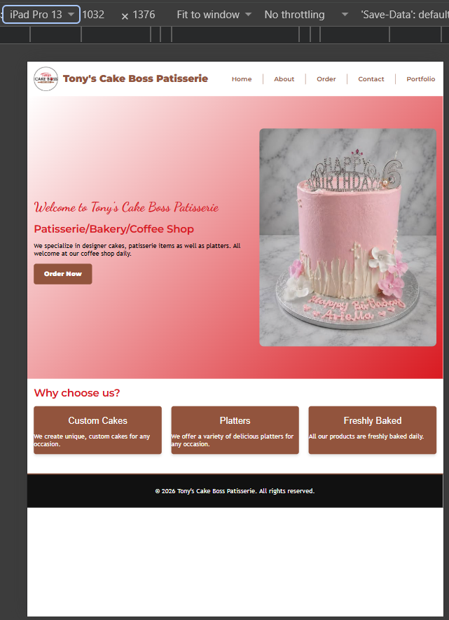
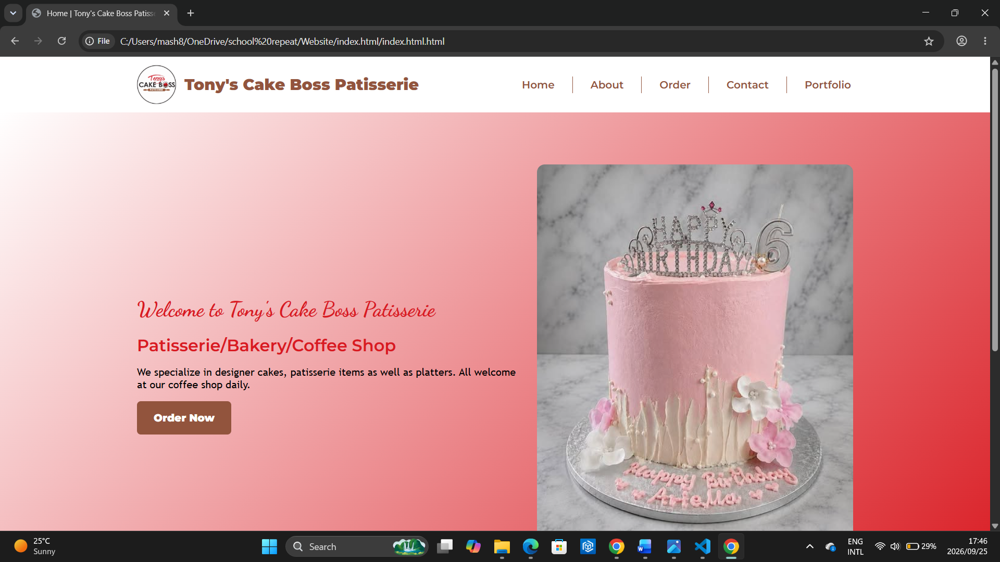

WEDE5112w POE

Mashudu Ntsieni

ST10507299

Declaration of AI Use:

I, Mashudu Ntsieni, have utilised AI tools (Google Gemini and GitHub Copilot) for this assignment to aid me with code.

Changelog:

Initial commit of files

Updated CSS files

Added another colour from the company's logo onto the website, hex code: #92543d

Updated the CSS and HTML of the index page

Made changes to the index page HTML

Updated the CSS, HTML, and added responsive design to all pages

Created the CSS style for the contact us page and edited the HTML

Added the logo to the contact us, order and portfolio pages

Updated the about us page mobile responsiveness, CSS updated on the contact us, order and portfolio pages

Styled the portfolio page, updated the CSS of the index page

Updated the about us page tablet responsiveness, CSS updated on the contact us, order and portfolio pages

Uploaded screenshots of the website on different devices in readme file

Updated the fonts for the typography on all pages

Updated reference list

Updated screenshots

Screenshots of website on different devices:

Updated screenshots of the website on different devices:

References:

Host Africa, 2021. How much does a website cost in South Africa? [online] Available at: <https://hostafrica.co.za/blog/websites/website-basics/how-much-does-a-website-cost-in-south-africa> [Accessed 21 August 2026].

Host Africa, 2022. How much does web design cost in South Africa? [online] Available at: <https://hostafrica.co.za/blog/websites/web-design/how-much-does-web-design-cost-in-south-africa> [Accessed 21 August 2026].

Host Africa, 2023. How to host a website: A complete beginner’s guide. [online] Available at: <https://hostafrica.co.za/blog/tutorials/how-to-host-a-website> [Accessed 21 August 2026].

South African Depression and Anxiety Group (SADAG), n.d. SADAG: South African Depression and Anxiety Group. [online] Available at: <https://www.sadag.org> [Accessed 21 August 2026].

Updated Reference List:

Tony's Cake Boss Patisserie, 2024. [Facebook] 29 March. Available at: <https://www.facebook.com/photo.php?fbid=1513390134124375&set=pb.100063602078984.-2207520000&type=3> [Accessed 24 September 2026].

Tony's Cake Boss Patisserie, 2026. Sweet, elegant & absolutely beautiful. [Facebook] 20 September. Available at: <https://www.facebook.com/photo?fbid=1674932127970174&set=a.441959934600739> [Accessed 24 September 2026].

Tony's Cake Boss Patisserie, 2026. Our adorable doggy cupcakes. [Facebook] 8 September. Available at: <https://www.facebook.com/photo?fbid=1667429748720412&set=a.441959937934072> [Accessed 24 September 2026].

Tony's Cake Boss Patisserie, 2026. ONE-derful, sweet and simply adirable. [Facebook] 15 August. Available at: <https://www.facebook.com/photo.php?fbid=1675708877892499&set=pb.100063602078984.-2207520000&type=3> [Accessed 24 September 2026].

Tony's Cake Boss Patisserie, 2026. Happy 9th birthday Nsovo. [Facebook] 31 August. Available at: <https://www.facebook.com/photo.php?fbid=1656428109820576&set=pb.100063602078984.-2207520000&type=3> [Accessed 24 September 2026].

Tony's Cake Boss Patisserie, 2026. Wedding bells were ringing again this weekend. [Facebook] 8 June. Available at: <https://www.facebook.com/photo.php?fbid=1577974424332612&set=pb.100063602078984.-2207520000&type=3> [Accessed 24 September 2026].

Tony's Cake Boss Patisserie, 2025. [Facebook] 29 December. Available at: <https://www.facebook.com/photo/?fbid=1435556175241105&set=a.441959944600738> [Accessed 24 September 2026].

Tony's Cake Boss Patisserie, 2026. [Facebook] 5 April. Available at: <https://www.facebook.com/photo.php?fbid=1520362276760494&set=pb.100063602078984.-2207520000&type=3> [Accessed 24 September 2026].

Tony's Cake Boss Patisserie, 2026. Isn't that the truth. [Facebook] 10 April. Available at: <https://www.facebook.com/photo?fbid=1524011636395558&set=a.441959937934072> [Accessed 24 September 2026].

Tony's Cake Boss Patisserie, 2021. His business partner Henk. [Facebook] 27 April. Available at: <https://www.facebook.com/photo/?fbid=1644959719039951&set=a.441959937934072> [Accessed 24 September 2026].

Tony's Cake Boss Patisserie, 2023. [Facebook] 2 September. Available at: <https://www.facebook.com/photo?fbid=779564000840329&set=pcb.779564200840309> [Accessed 24 September 2026].
